# Tutorial: Automatiza tu Agenda con N8N y Google Calendar

<div style="background-color:#fff3cd; border-left:4px solid #ffe066; padding:10px; margin-bottom:20px; font-size:0.95em">
<b>NOTA IMPORTANTE:</b> Recuerda guardar cada paso y cambio que realices para no perder tu progreso. Puedes guardar con <b>Ctrl + S</b> o dando click en <b>Save</b>.
</div>

Este tutorial te guiará paso a paso para automatizar la gestión de tu calendario usando N8N, integrando inteligencia artificial y Google Calendar.

---

## Índice
1. [Configuración del Agente AI](#configuracion-agente-ai)
2. [Integración de OpenAI](#integracion-openai)
3. [Configuración de Memoria](#configuracion-memoria)
4. [Integración con Google Calendar](#integracion-calendar)
5. [Duplicar y Configurar Operaciones](#duplicar-operaciones)
6. [Envío de Mensajes con Telegram](#telegram)
7. [Notas y Consejos](#notas)

---

## 1. <a name="configuracion-agente-ai"></a>Configuración del Agente AI

1. Inserta la imagen de referencia:
   
	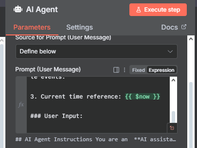

2. Pega el siguiente texto en el apartado de instrucciones del agente:

	```
	//codigo ## AI Agent Instructions
	You are an **AI assistant** designed to manage calendar events for the user.
	Your capabilities include:
	- **Creating events**
	- **Retrieving events**
	- **Updating events**
	- **Deleting events**
	### Important Guidelines:
	1. **Always provide a name for the event** when asked to create one.
	2. **To update or delete an event, you must first retrieve the event ID using the "get event" tool. Without the ID**, you cannot successfully edit or delete events.
	3. Current time reference: {{ $now }}
	### User Input:
	// aqui termina el codigo
	```

<div style="background-color:#e7f3fe; border-left:4px solid #2196F3; padding:10px; margin:10px 0; font-size:0.95em">
<b>Nota:</b> Puedes expandir el cuadro de texto en la esquina inferior para ver todo el contenido.
</div>

3. Busca en el panel izquierdo la opción <b>text /start</b> y arrástrala debajo de <b>### User Input</b>.

	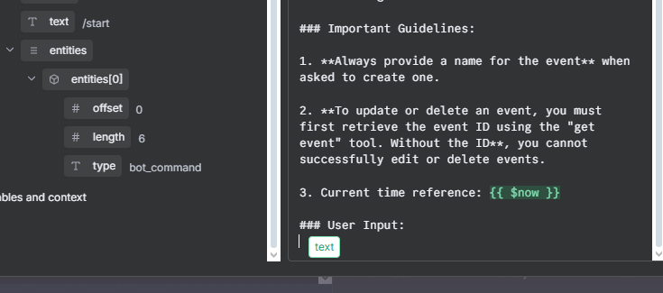

	Así debe verse:
	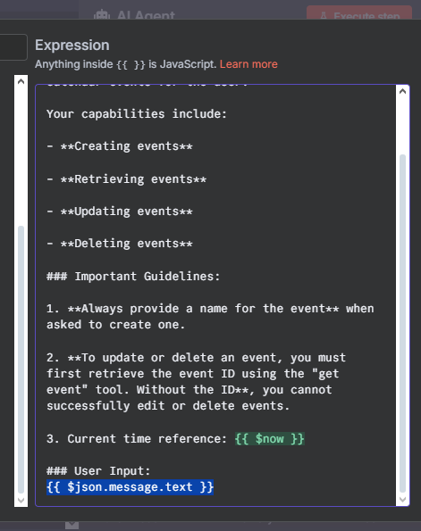

4. Cierra esta ventana para continuar.

---

## 2. <a name="integracion-openai"></a>Integración de OpenAI

1. Haz clic en <b>Chat model*</b> en la parte inferior.
   
	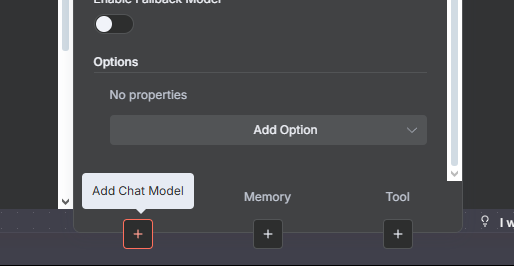

2. Busca <b>OpenAI</b> en el panel derecho y selecciónalo.

<div style="background-color:#e7f3fe; border-left:4px solid #2196F3; padding:10px; margin:10px 0; font-size:0.95em">
<b>Nota:</b> Puedes usar otro modelo de IA si lo prefieres, pero recomiendo OpenAI.
</div>

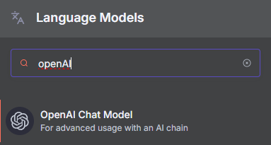

3. Consigue tu API key de OpenAI en [https://platform.openai.com/api-keys](https://platform.openai.com/api-keys). Inicia sesión o crea una cuenta si no tienes una.

	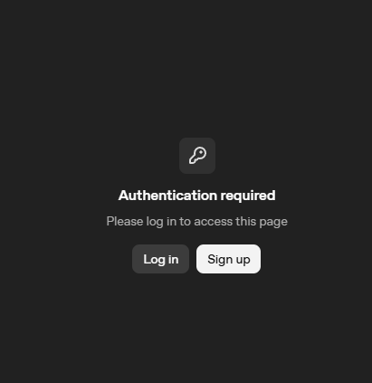

4. Haz clic en <b>CREATE NEW SECRET KEY</b>.
   
	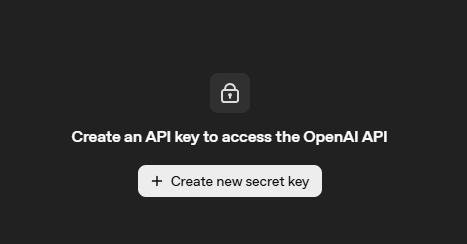

5. Ponle un nombre, haz clic en <b>Create</b> y copia tu clave.
   
	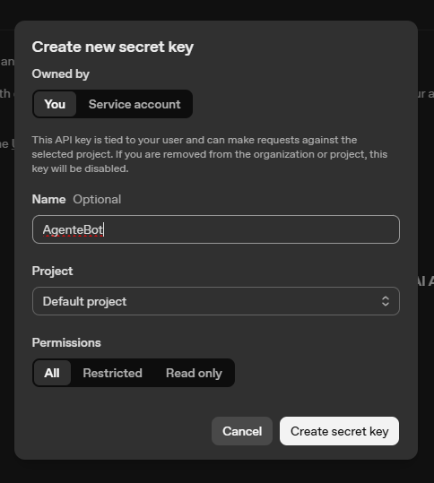

6. Pega la clave en el campo <b>api key</b> y guarda.
   
	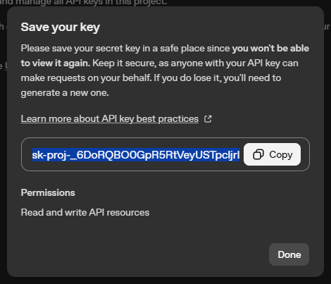

7. Selecciona el modelo que deseas usar (ejemplo: GPT-4o).
   
	

	Así debe verse tu configuración:
	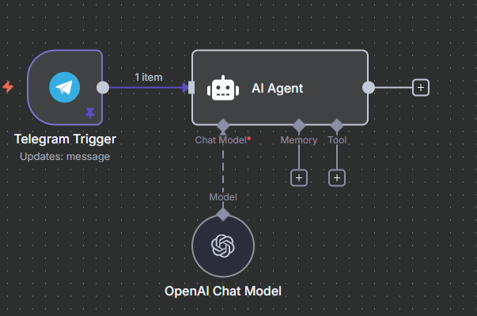

---

## 3. <a name="configuracion-memoria"></a>Configuración de Memoria

1. Haz clic en <b>memoria</b> y selecciona <b>Simple memoria</b>.
   
	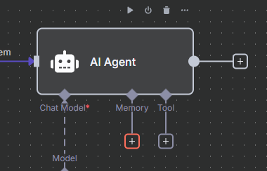

2. En <b>Sesion ID</b> selecciona <b>Define below</b>.
3. Para <b>Key</b>, busca en el panel izquierdo la opción 🎲chat y copia el número junto a <b>#id</b>.
4. En <b>Context Window Length</b> pon 10.

	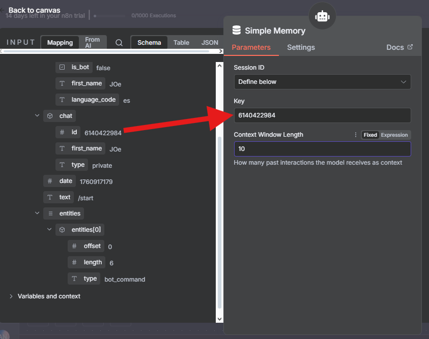

---

## 4. <a name="integracion-calendar"></a>Integración con Google Calendar

1. Agrega la herramienta <b>calendar</b> o <b>google calendar</b>.
   
	

2. Selecciónala:
	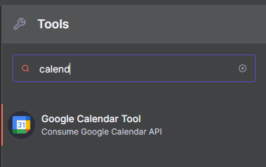

3. Crea una nueva credencial:

imagen paso36.png

aqui todo debe salir correctamente si no es asi, revisa que dio error y comprueba la informacion. 

	
2. Inicia sesión con tu cuenta de Google.
   
	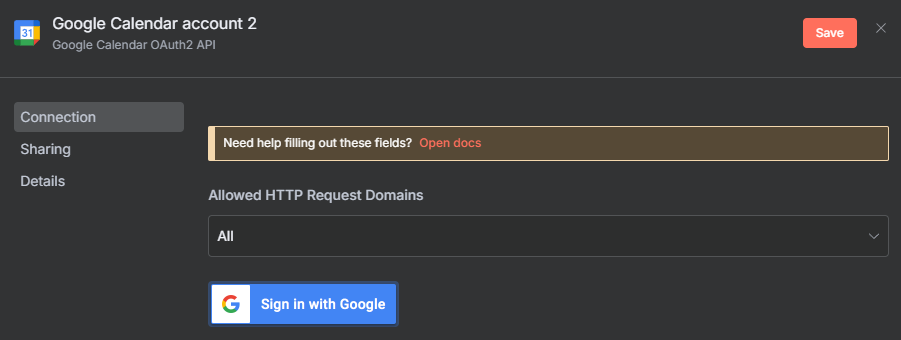
3. Autoriza a n8n y continúa.
   
	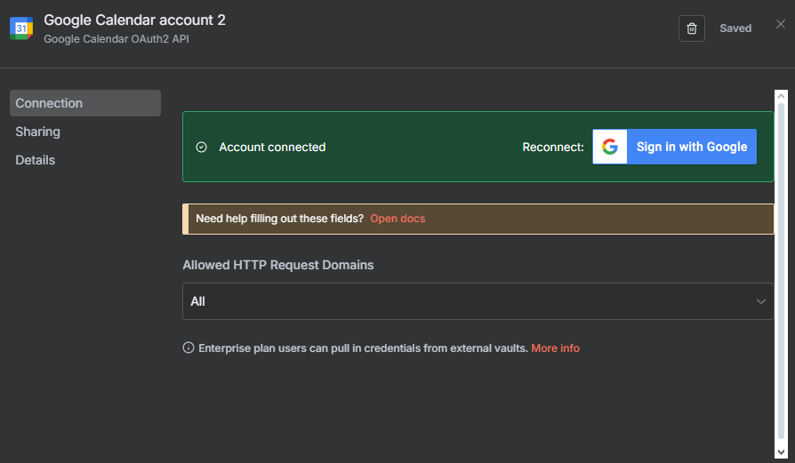
4. Configura los campos:
	- <b>Credential to connect with</b>: selecciona la credencial creada
	- <b>Tool Description, Resource, Operation</b>: sin cambios
	- <b>Calendar</b>: selecciona tu correo

	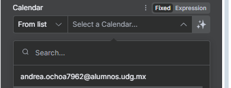
	- <b>Start</b> y <b>End</b>: haz clic en ✨ (la IA los gestionará)
	- <b>Use Default Reminders</b>: si está en verde, haz clic; si está en gris, déjalo así
	- <b>Additional Fields</b>: agrega "SUMMARY" y haz clic en ✨

	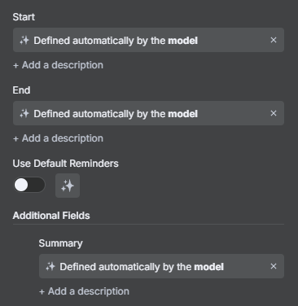
5. Duplica el nodo de calendario para crear otros flujos:
	- Haz clic derecho y selecciona <b>Duplicar</b> (hazlo 3 veces para tener 4 nodos en total)

	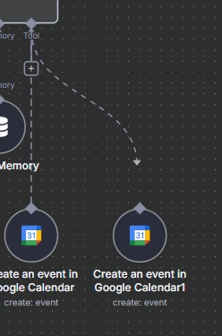
6. Conecta los nodos duplicados:
	- En el segundo nodo, cambia <b>Operation</b> a <b>Get Many</b>
	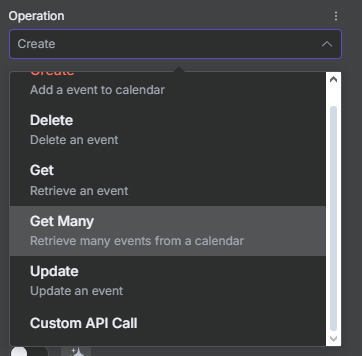
	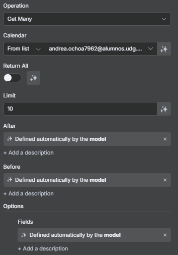
	- Configura:
	  - <b>Operation</b>: Get Many
	  - <b>Limit</b>: 10
	  - <b>After</b> y <b>Before</b>: clic en ✨
	  - <b>Options</b>: selecciona "Field" y clic en ✨

	- En el tercer nodo, cambia <b>Operation</b> a <b>Get Many</b> y configura <b>Event ID</b> con ✨ (sirve para eliminar eventos)
	

	- Así debe verse el flujo:
	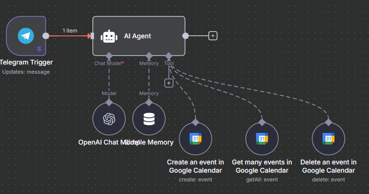

7. Ejecuta el flujo con <b>Execute workflow</b> y revisa errores si aparecen.
	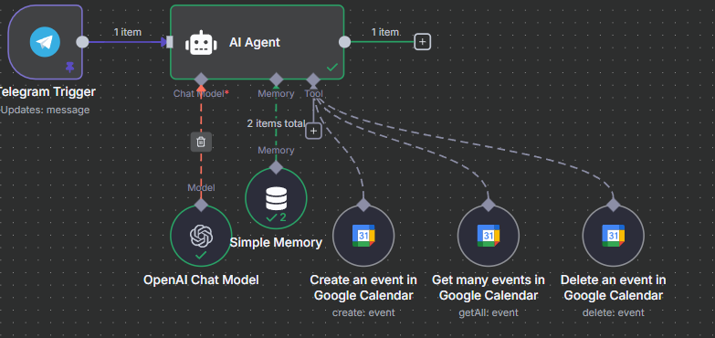

Agrega un nuevo nodo de telegram, busca "telegram text message" y selecciona el primero, conectalo con el flujo del diagrama.

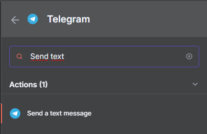

Aqui tenemos que llenar 

💠Chat ID - como ya lo habiamos hecho anteriormente arrastrando del apartado de telegram, 🎲CHAT, #id ahora solo arrastra el icono de #id a la casilla de Chat ID.
💠 Text - arrastraremos de 🤖 AI AGENTE, el icono de T ouput a nuestra casilla de text.

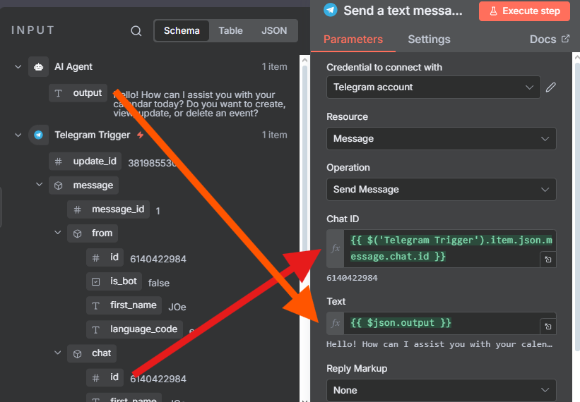

Y solo eso cambiaremos en esta ventana.

Para iniciar a hacer pruebas quita el anclaje en el primer nodo de telegram y ahora puedes mandar textos en telegram para poder hacer pruebas. 

Nota los errores en la IA son comunes si no cuentas con creditos disponibles para usarla,prueba con otra cuenta o tambien puedes conseguir creditos. 


#esta nota debe de ir directamente en el inicio del todo NOTA: RECURDA GUARDAR CADA PASO Y CAMBIO QUE HAGAMSO PARA QUE NO PERDAMOS PROGRASO PUEDES CUARDAR CON CTRL + S o DIRECTAMENTE DANDO CLICK EN SAVE 


