# Tutorial: Automatización con N8N, Telegram y OpenAI

**Proyecto:** Agente personal automatizado que gestiona eventos en tu calendario y envía recordatorios mediante Telegram.

---

## 🤖 

💠 Mensaje en telegram

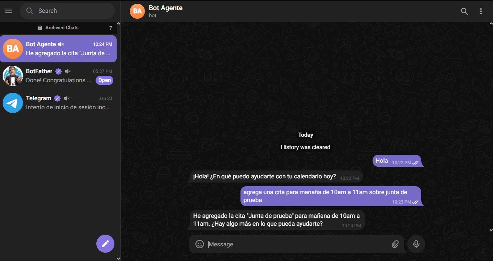

💠 Agenda en Google Calendar

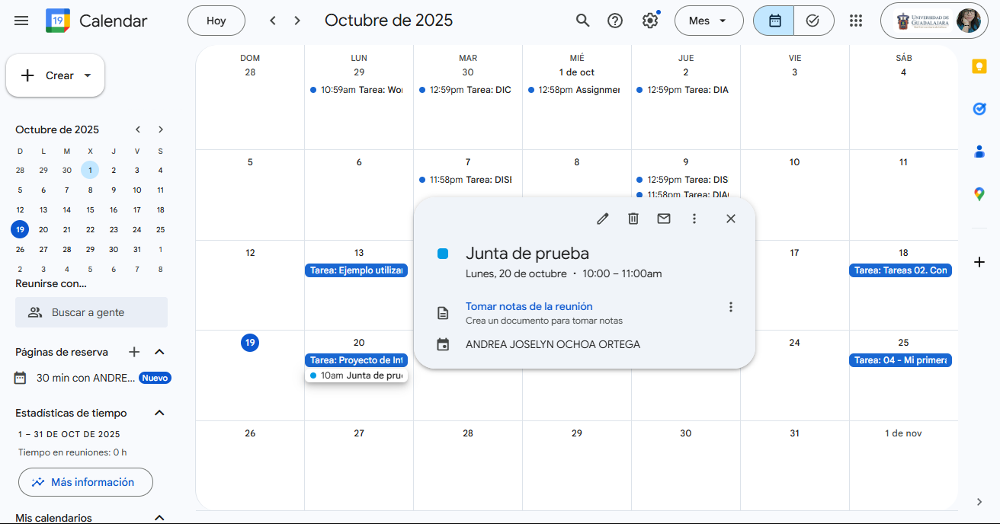

---

## ⚠️ NOTA IMPORTANTE

> **Recuerda guardar tu progreso constantemente.**
> Puedes hacerlo con **Ctrl + S** o presionando el botón **"Save"** dentro de N8N.
> Evita perder configuraciones o credenciales guardando en cada paso.

---

## 🧩 1. Crear cuenta en N8N

Regístrate en [https://www.n8n.io](https://www.n8n.io) e inicia sesión.

---

## ⚙️ 2. Iniciar un nuevo Workflow

Este será tu espacio de trabajo.

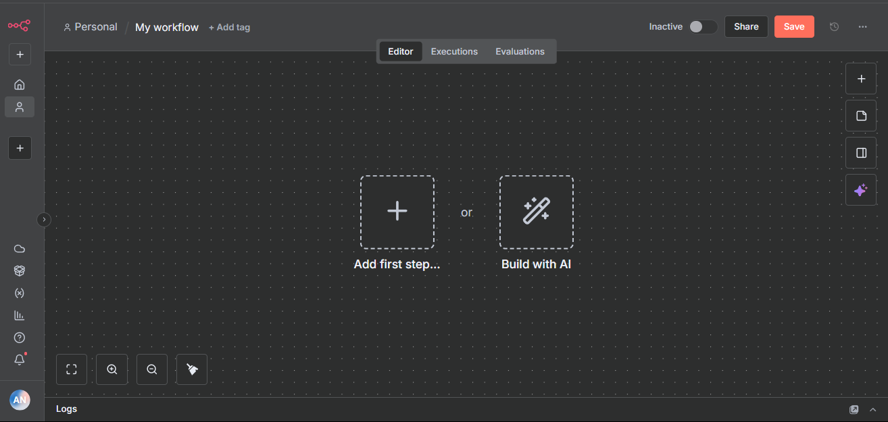

---

## 💬 3. Configurar el primer nodo: Telegram

1. Haz clic en **"Add first step"** para agregar nodos.  
2. Busca **"Telegram"** y selecciona **"On Message"**.


3. En la ventana emergente, selecciona **"Create new credential"** para agregar una nueva API.  
4. Abre [https://telegram.me/BotFather](https://telegram.me/BotFather) y crea tu bot.

> 💡 **Nota:** También puedes seguir la documentación oficial de N8N sobre Telegram.

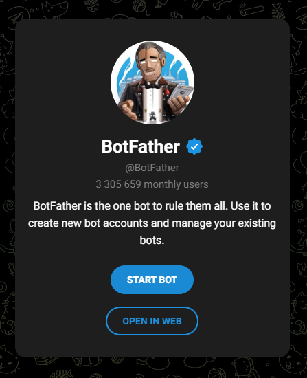

5. En BotFather, ejecuta los comandos `/start` y luego `/newbot`.  
   - Asigna un nombre a tu bot (si el nombre no es aceptado, intenta con otro).

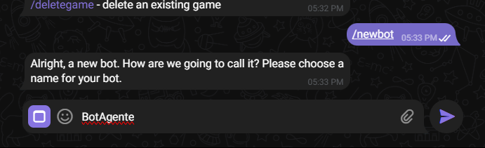

6. Copia el **API Token** que te proporciona BotFather y pégalo en N8N.  
   Guarda la credencial; si todo está correcto, verás un mensaje verde confirmando la conexión.

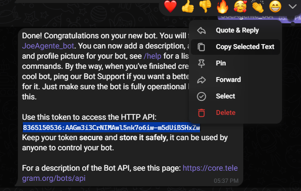

7. En el campo **"Credential to connect with"**, selecciona tu cuenta de Telegram.

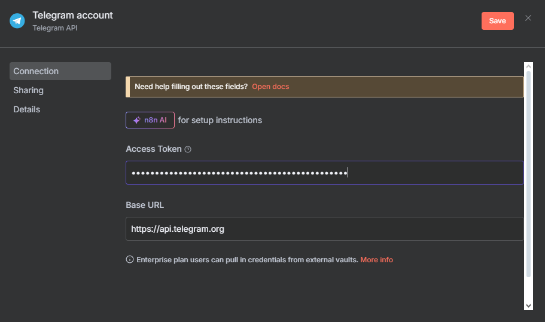

8. Puedes anclar información útil en el panel derecho para referencia futura.

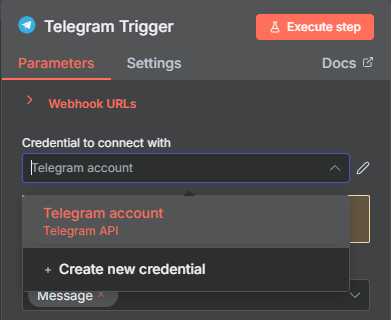

---

## 🤖 4. Agregar el nodo de Inteligencia Artificial (IA)

1. Presiona el **+** y busca “AI”.  
2. Selecciona **"AI Agent"**.

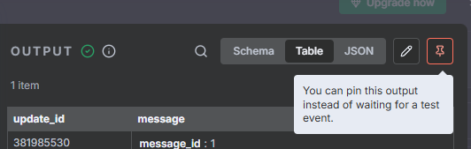
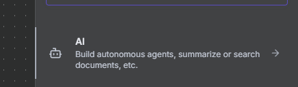

3. En **"Source for Prompt"**, elige **"Define below"**.  
4. En **"Prompt"**, pega el siguiente texto:

```markdown
## AI Agent Instructions

You are an **AI assistant** designed to manage calendar events for the user.

Your capabilities include:
- **Creating events**
- **Retrieving events**
- **Updating events**
- **Deleting events**

### Important Guidelines:
1. **Always provide a name for the event** when asked to create one.
2. **To update or delete an event, you must first retrieve the event ID using the "get event" tool. Without the ID**, you cannot successfully edit or delete events.
3. Current time reference: {{ $now }}

### User Input:
```

5. Amplía el cuadro de texto para ver todo el contenido completo.  
6. Arrastra desde el panel izquierdo el nodo **Text /start** y colócalo al final del texto debajo de `### User Input`.


---

## 💡 5. Configurar el modelo de Chat (OpenAI)

1. En la parte inferior, haz clic en **Chat model***.  
2. Busca **OpenAI** y selecciónalo.

> 💬 Si prefieres otro modelo de IA, puedes elegirlo. Se recomienda **OpenAI** por su rendimiento y compatibilidad.


3. Crea tu API key en [https://platform.openai.com/api-keys](https://platform.openai.com/api-keys).  
4. Presiona **"Create New Secret Key"**, nómbrala y copia el token.


5. Pega tu API Key en N8N y guarda los cambios.


6. En el campo **Model**, selecciona **GPT-4o**.

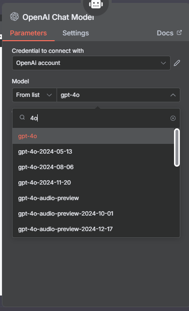

7. Ya tendrás Telegram y la IA conectados correctamente.


---

## 🧠 6. Configurar la memoria del agente

1. En **Memory**, selecciona **"Simple memory"**.  
2. En **Session ID**, elige **"Define below"**.  
3. En **Key**, copia el número del nodo de chat (🎲Chat → #id).  
4. En **Context Window Length**, escribe `10`.


---

## 📅 7. Conectar el Calendario (Google Calendar)

1. Agrega un nuevo **Tool** y busca **Calendar** o **Google Calendar**.


2. Crea una nueva credencial e inicia sesión con tu cuenta de Google.

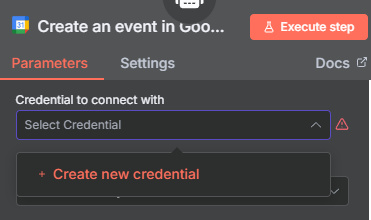


3. Autoriza el acceso y selecciona tu correo principal.


4. Completa los siguientes campos:
   - **Credential to connect with:** tu cuenta recién creada.
   - **Calendar:** selecciona tu correo principal.
   - **Start / End:** haz clic en ✨ para que la IA los gestione.
   - **Use Default Reminders:** déjalo en gris (desactivado).
   - **Additional Fields → SUMMARY:** también con ✨.


---

## 🔁 8. Duplicar y configurar nodos de calendario

1. Duplica el nodo principal de calendario **3 veces** (total: 4 nodos).  
2. Modifica cada uno según su función:

### a. Nodo 1 – Crear eventos  
Sin cambios.

### b. Nodo 2 – Obtener eventos  
- **Operation:** `Get Many`  
- **Limit:** `10`  
- **After / Before / Field:** usa ✨ para asignar dinámicamente.


### c. Nodo 3 – Eliminar eventos  
- **Operation:** `Delete`  
- **Event ID:** usa ✨

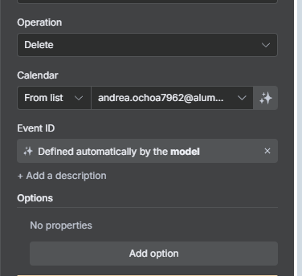

---

## ✅ 9. Probar el flujo completo

1. Haz clic en **Execute Workflow**.  
2. Si hay errores, revisa las credenciales y conexiones entre nodos.


---

## 💬 10. Enviar mensajes desde Telegram

1. Agrega un nuevo nodo **Telegram → Text Message**.  
2. Conecta el flujo con el nodo de la IA.  
3. Completa los campos:
   - **Chat ID:** arrastra 🎲Chat → #id  
   - **Text:** arrastra 🤖AI Agent → Output


Ahora puedes enviar mensajes en Telegram para probar el agente.

> ⚠️ **Nota:** Si la IA arroja errores, verifica que tu cuenta de OpenAI tenga créditos disponibles.


